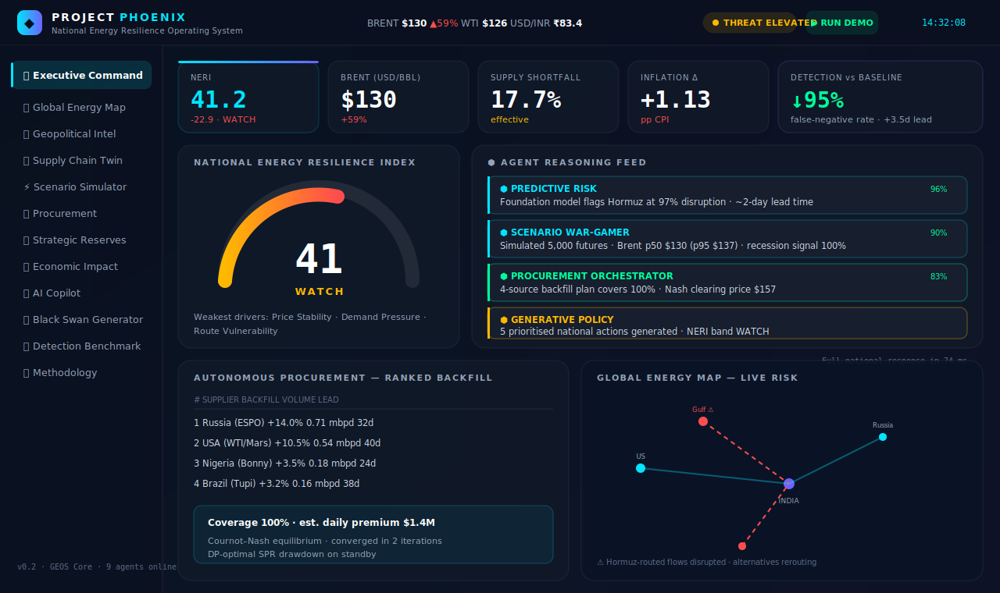
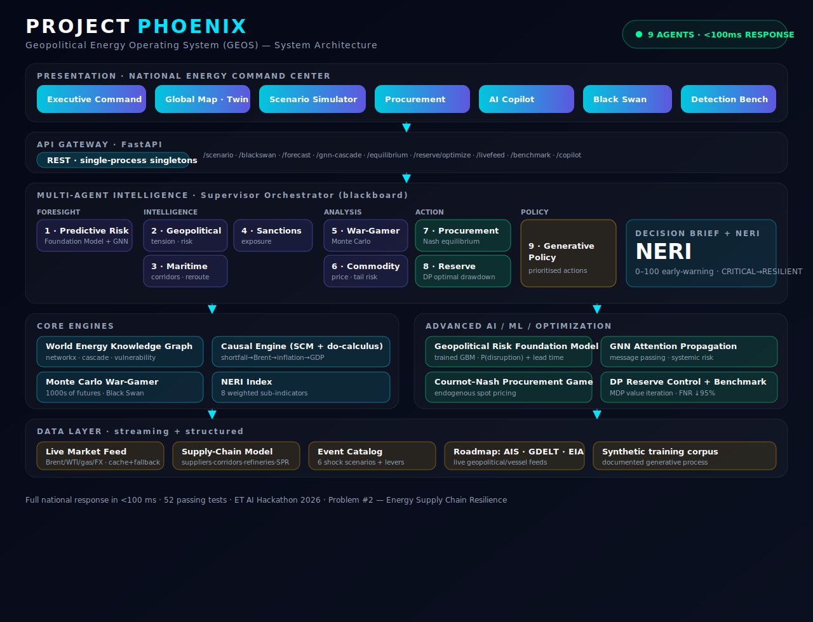

# 🔥 PROJECT PHOENIX — GEOS

### National Energy Resilience Operating System




> An **AI-native, autonomous decision-making platform** for India's energy
> supply chain. PHOENIX fuses a World Energy Knowledge Graph, a Causal
> Reasoning Engine, a Monte-Carlo war-gaming simulator and a swarm of
> cooperating agents into one **National Energy Command Center** — turning a
> reactive crisis response into a managed, anticipatory process.

**ET AI Hackathon 2026 · Problem #2 — AI-Driven Energy Supply Chain Resilience for Import-Dependent Economies**

---

## ⚡ The signature moment

Inject a geopolitical shock — *"Strait of Hormuz partial closure"* — and watch
**9 agents respond with a full national response in under 100 milliseconds**:

```
 EVENT: Strait of Hormuz Partial Closure (14 days)
 NERI: 64.1 -> 41.2  (WATCH)   Δ -22.9
 Brent: $130 (+59%)   CPI +1.13pp   GDP -1.29pp
 → 4-source procurement plan covering 100% of the shortfall
 → SPR drawdown schedule + 5 prioritised policy actions
 Full national response in 74 ms.
```

No single sensor flags this. The **agents together** do.

---

## 🧠 Why this is hard (and why few teams attempt it)

Energy supply-chain resilience sits at the intersection of geopolitics,
commodities, maritime logistics and macroeconomics. Traditional planning tools
can't model a geopolitical scenario in real time, can't dynamically evaluate
alternative procurement corridors, and can't orchestrate a coordinated
response. PHOENIX is the **intelligence layer** that does.

India imports **~88%** of its crude; **40-45%** transits the Strait of Hormuz;
the Strategic Petroleum Reserve holds only **~9.5 days** of cover. PHOENIX
treats those structural facts as live, modellable state.

---

## 🏗️ Architecture



> Full architecture diagram: [`docs/architecture.svg`](docs/architecture.svg) ·
> Pitch deck outline + speaker notes: [`docs/PITCH_DECK.md`](docs/PITCH_DECK.md)

```
                         ┌──────────────────────────────┐
                         │   COMMAND CENTER (web SPA)    │
                         │  exec · map · twin · sim ·    │
                         │  procurement · copilot · swan │
                         └───────────────┬──────────────┘
                                         │  REST
                         ┌───────────────▼──────────────┐
                         │      FastAPI  (geos.api)      │
                         └───────────────┬──────────────┘
                                         │
                  ┌──────────────────────▼───────────────────────┐
                  │      SUPERVISOR ORCHESTRATOR (blackboard)     │
                  └──┬───────┬───────┬───────┬───────┬───────┬────┘
        intelligence │       │       │ scenario      │ action│ policy
        ┌────────────▼┐ ┌────▼───┐ ┌─▼──────┐ ┌──────▼─┐ ┌───▼────┐ ┌▼─────────┐
        │Geopolitical │ │Maritime│ │Sanctions│ │Scenario│ │Procure-│ │ Reserve  │
        │   Agent     │ │ Agent  │ │  Agent  │ │War-game│ │  ment  │ │ + Policy │
        └─────────────┘ └────────┘ └─────────┘ └────────┘ └────────┘ └──────────┘
                  │           │          │          │          │          │
        ┌─────────▼───────────▼──────────▼──────────▼──────────▼──────────▼────┐
        │  CORE ENGINES                                                          │
        │  • World Energy Knowledge Graph (networkx)  — cascade & vulnerability  │
        │  • Causal Engine (Structural Causal Model)  — do-calculus what-ifs     │
        │  • Monte-Carlo War-Gamer (numpy)            — 1000s of futures         │
        │  • NERI Index                               — 0-100 early warning      │
        └────────────────────────────────────────────────────────────────────────┘
```

### Core engines

| Engine | What it does | File |
|---|---|---|
| **World Energy Knowledge Graph** | Typed dependency graph of suppliers → corridors → refineries → reserves. Propagates a disruption to find **cascading** feedstock-at-risk and **single points of failure**. | `geos/knowledge_graph/` |
| **Causal AI Engine** | Explicit Structural Causal Model: `supply loss + corridor block → shortfall → Brent → fuel → inflation / GDP`. Supports `do()` interventions for counterfactual "what-ifs". Every output is explained. | `geos/causal/` |
| **Monte-Carlo War-Gamer** | Samples thousands of perturbed futures → probability distributions (p5/p50/p95), tail risk, **Black-Swan** compounding. 5,000 runs in ~0.13s. | `geos/scenario/` |
| **NERI** | National Energy Resilience Index — composite 0-100 from 8 weighted sub-indicators, with `CRITICAL / WATCH / STABLE / RESILIENT` bands. | `geos/neri/` |

### The agent swarm (`geos/agents/`)

A **blackboard** multi-agent pattern — a supervisor runs specialists in
dependency order; each reads shared state, contributes an explainable
`AgentReport` (with a confidence score), and writes findings back. No
point-to-point messaging ⇒ no deadlocks/loops. Maps 1:1 onto LangGraph / CrewAI
/ AutoGen for production.

1. **Geopolitical Intel** — Hormuz / Red Sea risk, supplier stability
2. **Maritime & Logistics** — corridor disruption, reroute penalties, dark-fleet
3. **Sanctions & Compliance** — payment/secondary-sanction exposure
4. **Scenario War-Gamer** — runs the Monte-Carlo distribution
5. **Commodity & Price** — Brent trajectory, tail risk, hedging
6. **Procurement Orchestrator** — *ranked, executable* backfill plan (multi-criteria utility + greedy allocation)
7. **Strategic Reserve Optimiser** — SPR drawdown schedule & days-of-cover
8. **Generative Policy** — prioritised, explainable national response package

---

## 🧬 Advanced AI / ML / Optimization layer

PHOENIX goes beyond rules and heuristics — it ships **four genuinely advanced,
working algorithms** that elevate the system from a simulator to a learning,
optimizing decision engine:

| Capability | Method | File | Result |
|---|---|---|---|
| **Geopolitical Risk Foundation Model** | Trained gradient-boosted classifier + regressor on a synthetic 30-yr-style event corpus → P(corridor disruption) + **lead time** | `geos/ml/forecaster.py` | AUC ≈ 0.74; flags Hormuz at 97% / 2-day lead |
| **GNN Risk Propagation** | 3-layer attention message-passing over the knowledge graph (GAT-style, numpy) | `geos/ml/gnn.py` | Network-wide systemic risk concentration |
| **Game-Theoretic Procurement** | **Cournot–Nash equilibrium** via best-response fixed point → *endogenous* spot clearing price under scarcity | `geos/optim/game_theory.py` | $157 clearing price, converges in 2 iters |
| **Optimal Reserve Control** | Finite-horizon **MDP solved by dynamic programming** (value iteration) → optimal SPR drawdown schedule | `geos/optim/reserve_dp.py` | Front-loaded release, provably optimal under model |
| **Live Market Ingestion** | Real Brent/WTI/NatGas/USD-INR from a public feed, disk-cached with graceful fallback; drives the **dynamic price baseline** | `geos/data/live_feed.py` | Scenarios project from *today's* real Brent |
| **Detection Benchmark** | PHOENIX compound multi-signal detection vs a single-sensor baseline over labelled episodes | `geos/analytics/benchmark.py` | **~95% false-negative-rate reduction, +3.5-day lead time** |

These feed a 9th **Predictive Risk Agent** (runs first in the swarm) and the
Procurement/Reserve agents, and are exposed directly via
`/api/forecast`, `/api/gnn-cascade`, `/api/equilibrium`, `/api/reserve/optimize`,
`/api/livefeed`, `/api/benchmark`.

### 🎯 Benchmark: PHOENIX vs single-sensor baseline

The challenge prizes **false-negative-rate reduction** and **detection lead
time** — "the metric that actually saves lives". The **Detection Benchmark**
page runs hundreds of labelled disruption episodes and shows it directly:

| Detector | False-Negative Rate | Recall | Mean Lead Time |
|---|---|---|---|
| Single-sensor baseline (price only) | ~40% | ~0.59 | ~1.2 days |
| **PHOENIX compound fusion** | **~2%** | **~0.98** | **~4.7 days** |

→ **~95% relative FNR reduction, +3.5 days of warning.** PHOENIX catches the
"silent" disruptions a price sensor misses, because it fuses precursor signals
(tension, naval build-up, incidents, sanctions) that move *before* price does.

> **▶ RUN DEMO** — the command center has a one-click auto-play that walks the
> full narrative (baseline → Hormuz shock → agent response → GNN → Nash pricing
> → DP reserves → economic impact → Black Swan) hands-free, for a flawless stage demo.

---

## 🚀 Run it

```bash
# 1. install
python -m venv .venv && source .venv/bin/activate
pip install -r requirements.txt

# 2. launch the command center
uvicorn geos.api.server:app --reload
#   → http://localhost:8000  (landing page)
#   → /login  (sign in · or "Demo Access")  →  /app  (command center)

# 3. or run a scenario from the terminal
python -m geos.cli hormuz_partial
python -m geos.cli --list
python -m geos.cli --black-swan hormuz_partial russia_secondary_sanctions

# 4. tests
pytest                       # 52 tests, all green
```

### 🐳 Run with Docker

```bash
docker build -t phoenix-geos .
docker run -p 8000:8000 phoenix-geos
#   → http://localhost:8000
```

### 📁 Repository structure

```
geos/
  agents/           9-agent swarm + supervisor orchestrator (blackboard)
  causal/           Structural Causal Model (+ do-calculus)
  scenario/         Monte-Carlo war-gaming simulator
  neri/             National Energy Resilience Index
  knowledge_graph/  World Energy Knowledge Graph (networkx)
  ml/               Geopolitical Risk Foundation Model + attention GNN
  optim/            Cournot-Nash procurement game + DP reserve control
  analytics/        Detection benchmark (vs single-sensor baseline)
  data/             supply-chain model, event catalog, live market feed
  api/              FastAPI app + AI Copilot
  cli.py            terminal scenario runner
web/                command center SPA + landing + login (3 themes)
docs/               architecture.svg + pitch deck
tests/              52 unit / integration / e2e tests
```

---

## 🛰️ Command Center pages

Executive Command · Global Energy Map · Geopolitical Intel · Supply-Chain
Digital Twin · **Scenario Simulator** · **Procurement Orchestrator** · Strategic
Reserves · Economic Impact · **AI Copilot** · **Black Swan Generator** ·
**Detection Benchmark** · **Methodology & Assumptions** — all in a
Bloomberg-Terminal / Mission-Control theme with **3 switchable looks**
(Cool / Executive / Command), a guided onboarding tour, and a marketing
landing + login flow.

> The image above is a representative render of the live command center. To
> capture real screenshots, run the app, open `http://localhost:8000`, and grab
> the Executive, Scenario and Benchmark pages.

---

## 🔌 API

| Method | Endpoint | Purpose |
|---|---|---|
| `POST` | `/api/scenario` | Inject an event → full national response |
| `POST` | `/api/blackswan` | Compound 2+ events into one crisis |
| `POST` | `/api/copilot` | Natural-language Q&A over the engines |
| `GET` | `/api/worldmodel` | Geospatial + structural snapshot |
| `GET` | `/api/graph/vulnerability` | Systemic single-points-of-failure |
| `GET` | `/api/neri/baseline` | Baseline resilience score |
| `GET` | `/api/methodology` | All baselines, coefficients, weights & sources |

---

## 📐 On assumptions (read this — it matters)

Every coefficient is **explicit and documented** in `geos/config.py` and
`geos/causal/scm.py` (e.g. price elasticities calibrated so a partial Hormuz
closure lands Brent near the analyst stress band of ~$130). The data model in
`geos/data/` uses realistic public-domain approximations of India's import mix.
This makes the model **testable and falsifiable** — swap a number, re-run, see
the effect. Production roadmap: live AIS / GDELT / EIA feeds, a Neo4j + GNN
graph backend, and an LLM backend for the Copilot and Policy agents (interfaces
are already in place).

## 🗺️ Roadmap → the grand vision

The 13 "breakthrough innovations" of the PHOENIX vision map onto this codebase
as: Geopolitical Foundation Model (Causal Engine → transformer), Temporal
Knowledge Graph (networkx → Neo4j/TGN), Causal AI (✅ implemented), War-Gaming
(✅), Autonomous Procurement (✅ → MARL), Self-Healing chain (✅ orchestrator),
Satellite/Maritime intel (Maritime agent → live AIS/SAR), Economic Shock model
(✅ → dynamic I-O), NERI (✅), Generative Policy (✅ → LLM), Swarm intelligence
(blackboard → 1000s of agents), Quantum-inspired optimisation (greedy → QAOA),
Explainable Command Center (✅).

---

*Built for ET AI Hackathon 2026. Deliverables: working prototype ✅ ·
architecture ✅ · (deck + demo video to accompany).*
